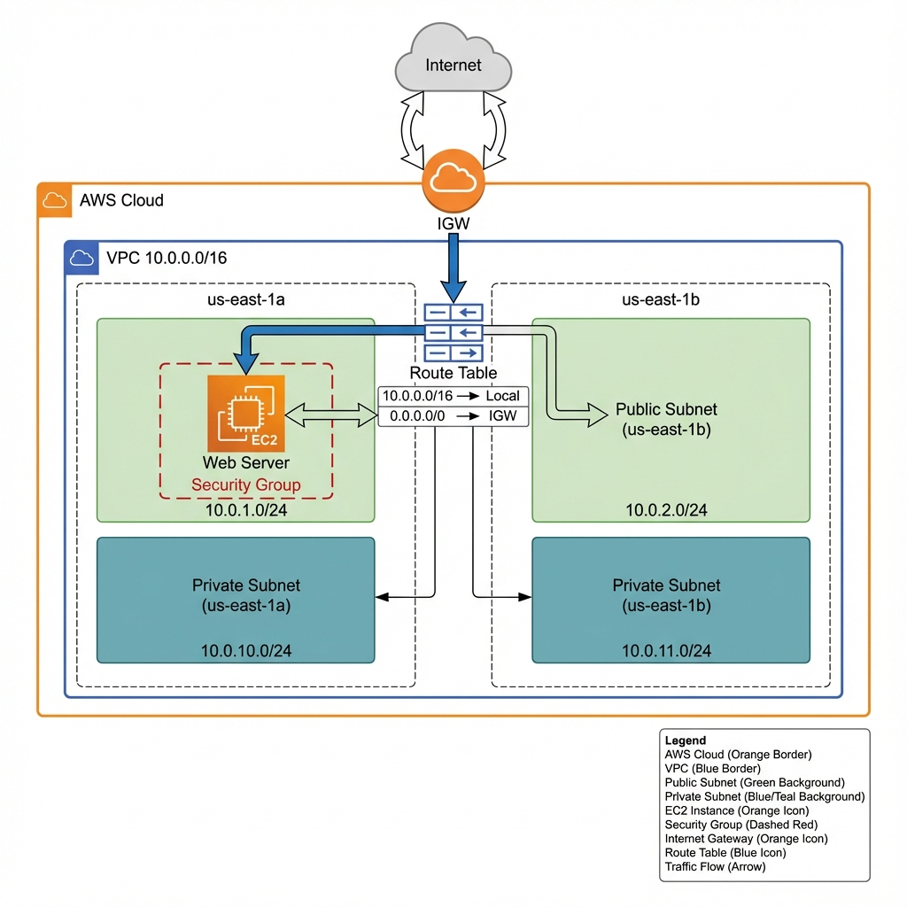

# Terraform Infrastructure Modules Library

Production-ready, reusable Terraform modules for AWS infrastructure following best practices.

## 🏗️ Architecture Diagram

```
┌─────────────────────────────────────────────────────────────────────────────────┐
│                                    AWS CLOUD                                     │
│  ┌───────────────────────────────────────────────────────────────────────────┐  │
│  │                         VPC (10.0.0.0/16)                                 │  │
│  │                                                                           │  │
│  │   ┌─────────────────────┐         ┌─────────────────────┐                 │  │
│  │   │   AVAILABILITY      │         │   AVAILABILITY      │                 │  │
│  │   │      ZONE 1         │         │      ZONE 2         │                 │  │
│  │   │   (us-east-1a)      │         │   (us-east-1b)      │                 │  │
│  │   │                     │         │                     │                 │  │
│  │   │ ┌─────────────────┐ │         │ ┌─────────────────┐ │                 │  │
│  │   │ │  Public Subnet  │ │         │ │  Public Subnet  │ │                 │  │
│  │   │ │  10.0.1.0/24    │ │         │ │  10.0.2.0/24    │ │                 │  │
│  │   │ │                 │ │         │ │                 │ │                 │  │
│  │   │ │  ┌───────────┐  │ │         │ │                 │ │                 │  │
│  │   │ │  │    EC2    │  │ │         │ │                 │ │                 │  │
│  │   │ │  │ (Web Srv) │  │ │         │ │                 │ │                 │  │
│  │   │ │  │   :22     │  │ │         │ │                 │ │                 │  │
│  │   │ │  └───────────┘  │ │         │ │                 │ │                 │  │
│  │   │ │        │        │ │         │ │                 │ │                 │  │
│  │   │ └────────┼────────┘ │         │ └─────────────────┘ │                 │  │
│  │   │          │          │         │                     │                 │  │
│  │   │ ┌────────┼────────┐ │         │ ┌─────────────────┐ │                 │  │
│  │   │ │ Private Subnet │ │         │ │ Private Subnet  │ │                 │  │
│  │   │ │  10.0.10.0/24  │ │         │ │  10.0.11.0/24   │ │                 │  │
│  │   │ │                │ │         │ │                 │ │                 │  │
│  │   │ │   (Database,   │ │         │ │   (Database,    │ │                 │  │
│  │   │ │   App Servers) │ │         │ │   App Servers)  │ │                 │  │
│  │   │ │                │ │         │ │                 │ │                 │  │
│  │   │ └────────────────┘ │         │ └─────────────────┘ │                 │  │
│  │   │                     │         │                     │                 │  │
│  │   └─────────────────────┘         └─────────────────────┘                 │  │
│  │                                                                           │  │
│  │   ┌───────────────────────────────────────────────────────────────────┐   │  │
│  │   │                        ROUTE TABLES                               │   │  │
│  │   │                                                                   │   │  │
│  │   │   Public RT:  0.0.0.0/0 → Internet Gateway                        │   │  │
│  │   │   Private RT: Local traffic only (NAT Gateway optional)           │   │  │
│  │   │                                                                   │   │  │
│  │   └───────────────────────────────────────────────────────────────────┘   │  │
│  │                                    │                                      │  │
│  └────────────────────────────────────┼──────────────────────────────────────┘  │
│                                       │                                         │
│                              ┌────────┴────────┐                                │
│                              │ Internet Gateway│                                │
│                              │     (IGW)       │                                │
│                              └────────┬────────┘                                │
│                                       │                                         │
└───────────────────────────────────────┼─────────────────────────────────────────┘
                                        │
                                   ┌────┴────┐
                                   │INTERNET │
                                   │   🌐    │
                                   └─────────┘
```

### Professional Architecture View



## 📁 Project Structure

```
Terraform-Modules/
├── modules/                    # Reusable Terraform modules
│   ├── vpc/                    # VPC Module
│   │   ├── main.tf             # VPC, Subnets, IGW, Routes
│   │   ├── variables.tf        # Input variables
│   │   └── outputs.tf          # Exported values
│   │
│   └── ec2/                    # EC2 Module
│       ├── main.tf             # EC2 Instance, Security Group
│       ├── variables.tf        # Input variables
│       └── outputs.tf          # Exported values
│
├── live/                       # Environment implementations
│   └── prod/                   # Production environment
│       ├── main.tf             # Combines modules
│       ├── variables.tf        # Environment-specific vars
│       └── outputs.tf          # Deployment outputs
│
└── README.md                   # This file
```

## 🚀 Modules Overview

### VPC Module

Creates a production-ready VPC with:
- **VPC** with DNS support enabled
- **2 Public Subnets** across multiple AZs
- **2 Private Subnets** across multiple AZs
- **Internet Gateway** for public internet access
- **Route Tables** properly configured

**Inputs:**
| Variable | Type | Description |
|----------|------|-------------|
| `vpc_cidr` | string | CIDR block for VPC (default: 10.0.0.0/16) |
| `project_name` | string | Project name for tagging |
| `environment` | string | Environment (dev/staging/prod) |
| `public_subnets` | list(string) | Public subnet CIDRs |
| `private_subnets` | list(string) | Private subnet CIDRs |
| `availability_zones` | list(string) | AZs to deploy to |

**Outputs:**
| Output | Description |
|--------|-------------|
| `vpc_id` | VPC ID |
| `vpc_cidr_block` | VPC CIDR block |
| `public_subnet_ids` | List of public subnet IDs |
| `private_subnet_ids` | List of private subnet IDs |
| `igw_id` | Internet Gateway ID |

---

### EC2 Module

Creates an EC2 instance with:
- **EC2 Instance** with configurable AMI and type
- **Security Group** with SSH access (port 22)
- **Key Pair** support for SSH access

**Inputs:**
| Variable | Type | Description |
|----------|------|-------------|
| `ami_id` | string | AMI ID for the instance |
| `instance_type` | string | Instance type (default: t2.micro) |
| `subnet_id` | string | Subnet to launch instance in |
| `vpc_id` | string | VPC ID for security group |
| `key_name` | string | SSH key pair name |
| `project_name` | string | Project name for tagging |
| `environment` | string | Environment name |

**Outputs:**
| Output | Description |
|--------|-------------|
| `instance_id` | EC2 Instance ID |
| `public_ip` | Public IP address |
| `private_ip` | Private IP address |
| `security_group_id` | Security Group ID |

---

## 📋 Usage

### Step 1: Navigate to environment folder

```bash
cd live/prod
```

### Step 2: Create terraform.tfvars

```hcl
# terraform.tfvars
project_name = "my-project"
environment  = "prod"
key_name     = "your-ssh-key-name"
ami_id       = "ami-0c02fb55956c7d316"  # Amazon Linux 2023
```

### Step 3: Initialize and Deploy

```bash
terraform init
terraform plan
terraform apply
```

### Step 4: Connect to EC2

```bash
ssh -i your-key.pem ec2-user@<public-ip>
```

---

## 🔒 Security Considerations

### Current Configuration:
- **SSH (Port 22)** open from `0.0.0.0/0` - **Change for production!**

### Production Recommendations:
```hcl
# Restrict SSH to your IP only
cidr_blocks = ["YOUR_IP/32"]

# Or use bastion host
cidr_blocks = [module.bastion.private_ip]
```

---

## 💡 Interview Talking Points

### Q: Why use modules instead of a single main.tf?
**A:** "Modules provide **reusability**, **consistency**, and **maintainability**. The same VPC module can be used across dev, staging, and prod with different inputs. It also enforces standards through required tags and security configurations."

### Q: How do modules communicate?
**A:** "Through **outputs**. The VPC module exports `vpc_id` and `subnet_ids`, which the EC2 module consumes as inputs. This creates a clear dependency graph."

### Q: What happens if you apply this without internet?
**A:** "The provider download will fail. We'd need a local plugin cache or private registry for air-gapped environments."

---

## 🏆 Skills Demonstrated

- ✅ **Infrastructure as Code** - Terraform HCL
- ✅ **Modular Design** - Reusable, composable modules
- ✅ **AWS Networking** - VPC, Subnets, Route Tables, IGW
- ✅ **Security** - Security Groups, least-privilege
- ✅ **Best Practices** - Tagging, naming conventions
- ✅ **Multi-AZ** - High availability design

---

## 📚 Future Enhancements

- [ ] Add NAT Gateway for private subnet internet access
- [ ] Add RDS module for databases
- [ ] Add ALB module for load balancing
- [ ] Implement remote state (S3 + DynamoDB)
- [ ] Add Terraform Cloud integration
- [ ] Create dev/staging environments
- [ ] Add auto-scaling groups

---

## 👨‍💻 Author

Built as part of DevOps/SRE portfolio. Demonstrates practical Terraform and AWS skills.
